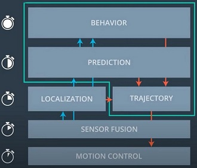
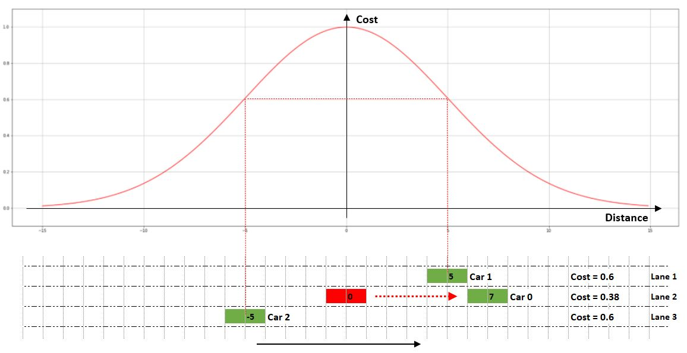

# CarND-Path-Planning-Project
Self-Driving Car Engineer Nanodegree Program

---
In this project implemented a path planner to safely navigate around a virtual highway with other traffic that is driving +-10 MPH of the 50 MPH speed limit. 
The car's localization and sensor fusion data comes fom a [car simulation](https://github.com/udacity/self-driving-car-sim/releases/tag/T3_v1.2), there is also a sparse map list of waypoints around the highway. 

---
## Dependencies & running code

For the detailed running instructions, please look at [INSTRUCTIONS](./INSTRUCTIONS.md). Also for more information about sensor fusion data from a simulation, click [here](./SENSOR.md)

---
## Highway Path Planning Algorithm

As highlighted by green line in below figure, the path planning consists of three main components to be discussed in next sections: `Prediction`, `Behavior Planning` and `Trajectory`. 



The following is key steps of the path planning algorithm:
* __Prediction__ of motion for all other cars
* Is there too close car that is in front of ego car?
* If too close, consider __Behavior Planning__ (state transition) and decide the lane change
* If too close, adjust speed
* If lane change, adjust lane
* Compute __Trajectory__

## 1. Prediction

In this project, predicting a lane change of other cars may be not useful since a road is circular highway. So machine learning (data-driven) technique was not implemented, but model-based approach.
Every 0.02s from the car simulator the path planning application gets new sensor fusion data including car's unique ID, car's x position in map coordinates, car's y position in map coordinates, car's x velocity in m/s, car's y velocity in m/s, car's s position in frenet coordinates, car's d position in frenet coordinates. 
For sake of simplicity, the prediction algorithm computes positions of an observed cars in future only based on assumption of constant speed it has. It predicts car's S positions in frenet coordinates for three consecutive time steps that are required by a lane change (KeepLane -> PrepareLaneChangeLeft -> ChangeLeft).

```
def Predict(observations, prev_size)
  N = size(observations)
  predictions[N]

  for i=1...N
    car_d = observations[i][6]
    car_lane = (car_d <= 4) ? 0: (car_d>4 && car_d<=8) ? 1:2
    
    car_id = observations[i][0]
    vx = observations[i][3]
    vy = observations[i][4]
    car_velocity = sqrt(vx*vx + vy*vy)
    s_at_t0 = observations[i][5]
    s_at_t1 = s_at_t0 + (prev_size*0.02*car_velocity)
    s_at_t2 = s_at_t0 + 2*(prev_size*0.02*car_velocity)
    s_at_t3 = s_at_t0 + 3*(prev_size*0.02*car_velocity)
    
    predictions[i] = {car_id, car_lane, car_velocity, s_at_t1, s_at_t2, s_at_t3}
    
  return predictions
```

## 2. Behavior Planning

The behavior planning's main role is to choose a optimal state with the minimum cost from all possible next states. It is called State transition that has two main components: `Finite State Machine` and `Cost Calculation`.

#### Behavior planning or State transition steps:
* Find successor states for current state (Finite State Machine). Basically, each state represents one of lanes. For example, a state `KeepLane` is current lane where my car is on and `LaneChangeLeft` is left hand side's lane etc...
* Calculate total cost of each surrounding car on lane present by successor state.
* Find maximum cost (Cost Calculation) for respective successor state (lane).
* Choose a state with minimum cost from all successor states.

### 2.1 Finite State Machine
To do transition between all possible states (logically connected), a Finite State Machine technique is widely used as well as in this project.
For the behavior planning, Finite State Machine was implemented as depicted in below figure.


### 2.2 Cost calculation

In order to make a state transition more accurate, two different cost functions to be explained below sections were implemented and sum of them defines a total cost of each state.
The following is pseudo code for total cost calculation for each state.

```
def CalculateCost(car_s, car_speed, state, predictions)
  N = size(predictions)
  for i = 1...N
    cost = 0.0
    predicted_s = predictions[i][3]
    predicted_velocity = predictions[i][2]

    cost += CostFunctionDistance(predicted_s - car_s)
    cost += CostFunctionSpeed(car_speed, predicted_velocity, (predicted_s - car_s))

    costs[i] = cost

  return max(costs)
```

### 2.2.1 Cost function for distance
Initial idea was to find a mathematical equation that increases a cost when a distance in Frenet coordinates between a observed car and my car gets shorter or decreases the cost when distance increases .
In this purpose, any function that could be similar to Gaussian distribution fits very well. So I picked below equation which is always between `0 <= Y <= 1`.


__Equation 1.__

This equation for a cost satisfies the initial requirements, but it doesn't works well in certain situations. Let's look at below figure. Ego car is Red one and there are three other green cars on different lane. 
* Distance to __Car 1__ is 5m 
* Distance to __Car 2__ is -5m 
* Distance to __Car 0__ is 7m

Cost function gives same value (0.6) for __Car 1__ and __Car 2__ due to same absolute value of distance. For __Car 0__ its cost is 0.38.
Since our state transition chooses the state with the minimum cost, it is decided to stay on current lane. Obviously, this decision is wrong and changing to lane 3 is right one. 



Thus, __Equation 1__ was modified to consider whether car is behind or ahead of my car and introduced new equation as shown below.


__Equation 2.__

Condition `x < -4` tells that a cost decreases if an observed car is at least 4m far away from ego car. Generally, 4m is safe distance (in my opinion). However, we can increase or decrease it.
For new equation let's consider same example which talked above. Generally, it behaves exactly what I expected and it choose a state __PrepareLaneChangeRight__ because it has the minimum cost. 
For this project, the Equation 2 is implemented.


### 2.2.2 Cost function for speed
Even __Equation 2__ works well in terms of distance to observed car, it has also some drawbacks. The Equation 2 doesn't consider speed of observed car. 
Let's imagine that __Car 2__ is going faster than ego car, and then the ego car tries to get in front of that car. The most probably, a collision would occur.
In real life, it is really bad situation to jeopardizing life of passengers in both cars. This is why we need another cost function to consider speed of cars.
Requirements of this cost function is like:

For behind cars:
* Cost would be increased if behind car moves faster than ego car
* Cost would be decreased if behind car moves slower than ego car

For ahead cars:
* Cost would be increased if ahead car moves slower than ego car
* Cost would be decreased if ahead car moves faster than ego car

From above requirements, sine function (-pi/2<x<pi/2) looks very good choice.

For behind cars __`if distance < -2`__ (safe distance is 2m):


For ahead cars __`if distance => 0`__:


Now let's insert new cost into above example. Assume that:

* my car speed is 40mph and 
* __Car 0__'s speed is 40mph
* __Car 1__'s speed is 35mph
* __Car 2__'s speed is 50mph

As shown in below figure, due to newly-introduced cost a total cost of `PrepareLaneChangeLeft` and `PrepareLaneChangeRight` increases respectively by 0.124 and 0.247, whereas `KeepLane` cost doesn't change because of same speed for both ego car and __Car 0__.
Since `KeepLane` state cost is the lowest, it is decided to stay on current lane.


## 3. Trajectory

Trajectory implementation by instructor was used because it was well designed and coded. 
Basically, the trajectory generates 50 points along waypoints based on the given lane of highway using [spline](https://kluge.in-chemnitz.de/opensource/spline/) library.
The following is Trajectory pseudo code:

```
def Trajectory()
  if previous path exists
    Use 2 points of previous path as starting reference points 
    Add to reference points
  else
    Use 2 points that make the path tangent to the car as starting reference points
    Add to reference points

  Create evenly 30m spaced three points in Frenet coordinates ahead of the starting reference along with the given lane
  Add to reference points
  Shift car reference angle to 0 degrees

  Create a spline object
  Set reference points to spline

  Add the unvisited previous path points to __list__

  Calculate how to break up spline points so that we travel at our desired reference velocity

  Fill up the rest of our path planner (50 points)

  Rotate back to normal after rotating it earlier

  Add newly-calculated points to __list__

  return __list__
```
